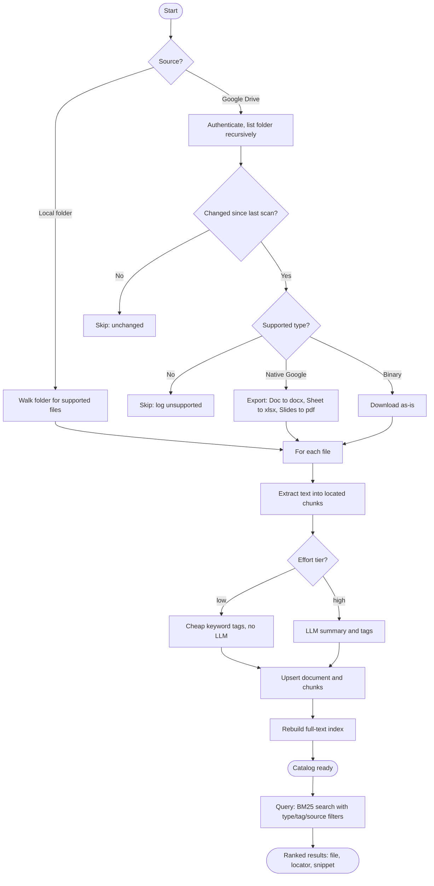

# Document Librarian

> Ingest a pile of mixed documents — PDFs, Word, Excel, CSV/TSV, JSON, HTML, Markdown, images — into one searchable catalog, then ask it questions and get back ranked, source-cited snippets.


## Overview

Document Librarian turns a heterogeneous folder of files (local or Google Drive) into a single
**DuckDB** catalog with full-text search. Each file is extracted into text chunks tagged with a
precise locator (page, sheet, row range, heading), enriched with metadata, and indexed for
**BM25** ranked retrieval. Instead of re-reading raw files, any downstream tool or person can ask
*"what do I know about X?"* and get back the most relevant passages with their source and location.

It is built around a **cost-tiered effort model**: the economical tier spends zero LLM tokens
beyond unavoidable image OCR, while the high tier adds vision OCR for scanned pages plus
LLM-generated summaries and topical tags — so you trade cost for richness explicitly.

## Features

- **Eight file types, each handled on its own terms:**
  - **PDF** — per-page text; scanned/image-only pages fall back to vision OCR (high tier).
  - **DOCX** — paragraphs *and* table cells, walked in document order.
  - **XLSX** — per-sheet rows, header repeated per chunk, sheet-named locators.
  - **CSV / TSV** — delimiter and encoding auto-sniffed (`,`/`;`/tab, UTF-8→CP1252 fallback) so locale exports don't collapse into one column.
  - **JSON / JSONL** — nested records flattened to searchable `a.b[0].c: value` lines.
  - **HTML** — scripts/styles stripped, `<title>` captured.
  - **Markdown** — split by headings, with each heading used as the chunk locator.
  - **Images** — transcribed and described by a vision model.
- **DuckDB full-text search (BM25)** with filters by file type, tag, and source.
- **Idempotent ingestion** — documents are keyed by a hash of identity + modified time, so
  re-scanning a large folder skips unchanged files.
- **Local *and* Google Drive sources** — native Google files are exported (Doc→docx, Sheet→xlsx,
  Slides→pdf) before extraction. *(Optional; see Google Drive support below.)*
- **Two effort tiers** trading token cost for enrichment depth.
- **41 tests** covering every extractor and the ingest/query pipeline.

## Demo

### How it works



### Sample run

```console
$ python -m scripts.ingest local ./docs --effort low
INFO | Ingested quarterly_report.pdf (8 chunks)
INFO | Ingested feedback_export.json (12 chunks)
INFO | Ingested locale_matrix.tsv (3 chunks)
INFO | Ingest complete: 14 documents, 96 chunks

$ python -m scripts.query "locale specific issues" --type xlsx --limit 3
1. [7.41] locale_matrix.xlsx (xlsx, sheet 'EU')
   uri: /docs/locale_matrix.xlsx
   region,locale,issue ... fr-CA,date format mismatch in export ...
2. [5.12] feedback_export.json (json, records 3-5)
   uri: /docs/feedback_export.json
   locale: es-CO  note.text: currency symbol rendered incorrectly ...
```

## Architecture / How it works

The pipeline is four modular stages, each independently testable:

1. **Extract** (`extractors.py`) — dispatch by file type to a tuned extractor that produces
   normalized chunks, each with a human-readable `locator`.
2. **Load** (`db.py`, `schema.sql`) — upsert documents and chunks into DuckDB; a stable
   `doc_id = hash(path + modified_time)` makes re-ingestion idempotent.
3. **Enrich** (`enrich.py`, `config.py`) — per effort tier, attach cheap keyword tags or
   LLM-generated summaries + tags.
4. **Index & Query** (`db.py`, `query.py`) — rebuild the BM25 full-text index, then serve ranked
   results filtered by type/tag/source.

The catalog schema separates `documents`, `chunks`, `doc_metadata`, and `tags`, with a nullable
`embedding` column reserved for future hybrid semantic search.

## Tech Stack

- **Language:** Python 3.12
- **Catalog & search:** DuckDB 1.5 (single-file database + native FTS / BM25)
- **Extraction:** PyMuPDF (PDF), python-docx (Word), openpyxl (Excel), pandas (CSV/TSV),
  BeautifulSoup4 (HTML), Pillow (images)
- **LLM integration:** langchain-openai against any **OpenAI-compatible** gateway (vision OCR +
  enrichment), configured via environment variables
- **Optional Google Drive source:** R's `googledrive`/`googlesheets4` bridged through `rpy2`
- **Testing:** pytest (41 tests), reportlab for synthetic PDF fixtures

## Getting Started

### Prerequisites

- Python 3.12 on PATH (from [python.org](https://www.python.org/) — tick "Add to PATH" on Windows)

### Installation

```bash
git clone https://github.com/Drzymek92/document-librarian.git
cd document-librarian
python -m venv .venv
.venv\Scripts\activate        # Windows  (source .venv/bin/activate on macOS/Linux)
pip install -r requirements.txt
cp config/.env.example config/.env   # then fill in your LLM gateway values
```

LLM-backed features (image OCR, the `high` effort tier) need an OpenAI-compatible endpoint — set
`LLM_BASE_URL`, `LLM_MODEL`, and `LLM_API_KEY` in `config/.env`. The default `low` tier works
without any LLM for all text-based formats.

### Usage

```bash
# Ingest a local folder (economical tier)
python -m scripts.ingest local ./docs --effort low

# Query the catalog
python -m scripts.query "client feedback" --type pdf --tag transcription --limit 5

# Run the test suite
pytest tests/
```

Ingest flags: `--effort {low,high}`, `--no-enrich`, `--db <path>`.
Query flags: `--type` (repeatable), `--tag` (repeatable), `--source {local,gdrive}`, `--limit`.

### Google Drive support (optional)

Google Drive ingestion is an optional extra that requires [R](https://www.r-project.org/) plus the
`googledrive`, `googlesheets4`, `readr`, `dplyr`, and `gargle` R packages, bridged via `rpy2`:

```bash
pip install -r requirements-gdrive.txt
python -m scripts.ingest gdrive <FOLDER_ID> --effort low
```

The first run opens a browser for one-time authentication; the token is cached and reused after.

## Project Structure

```
document-librarian/
├── scripts/
│   ├── ingest.py          # CLI entry: walk source → extract → enrich → load
│   ├── query.py           # CLI entry: BM25 search with filters
│   ├── extractors.py      # per-file-type extraction into located chunks
│   ├── db.py / schema.sql # DuckDB catalog + FTS index
│   ├── enrich.py          # summaries/tags per effort tier
│   ├── config.py          # effort tiers → model + enrichment selection
│   ├── llm_client.py       # OpenAI-compatible LLM access
│   ├── gdrive_*.py        # optional Google Drive listing/export/auth
│   └── manifest.py        # build a low-token descriptive index of a catalog
├── tests/                 # 41 pytest tests + fixtures
├── config/.env.example
├── requirements.txt
└── .github/workflows/ci.yml
```

## License

This project is licensed under the MIT License — see [LICENSE](LICENSE).
